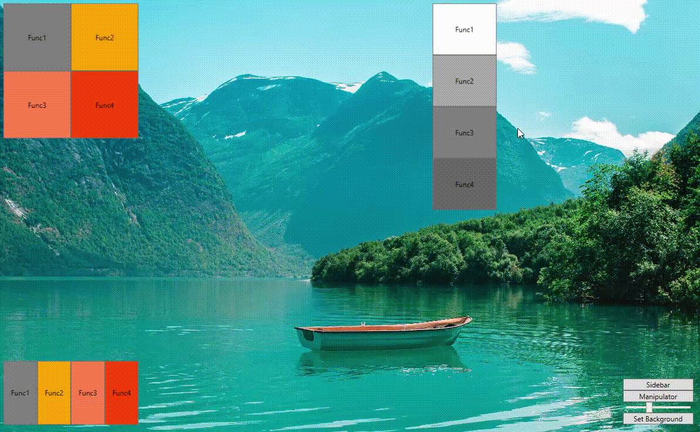

# Доска виджетов (WPF)
 | ReadMe | [Documentation](WidgetBoardControl/Documentation.md) |
 
## Описание

Данная библиотека компонентов WPF предоставляет компонент WidgetBoard, на котором вы можете реализовать UI, предоставляющий пользователю возможность размещения и масштабирования ваших UserControl в его поле

## Состав решения

- Библиотека WidgetBoard
- Пример библиотеки для реализации виджетов для доски
- Пример реализации WidgetBoard с получением виджетов из библиотеки

## Функционал

Данное решение умеет:
- привязывать расположение и масштаб виджетов к сетке
- предоставлять настраиваемые размерность сетки и размер ячейки
- принимать цветовые схемы оформления через свойства
- передавать экземплярам виджетов пользовательские настройки
- сериализовать и десериализовать расположение и виджетов, а также их настройки
- сохранять и восстанавливать положение виджетов и их настройки при открытии
